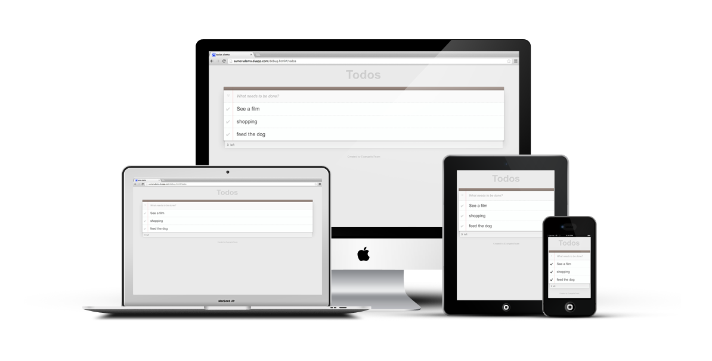
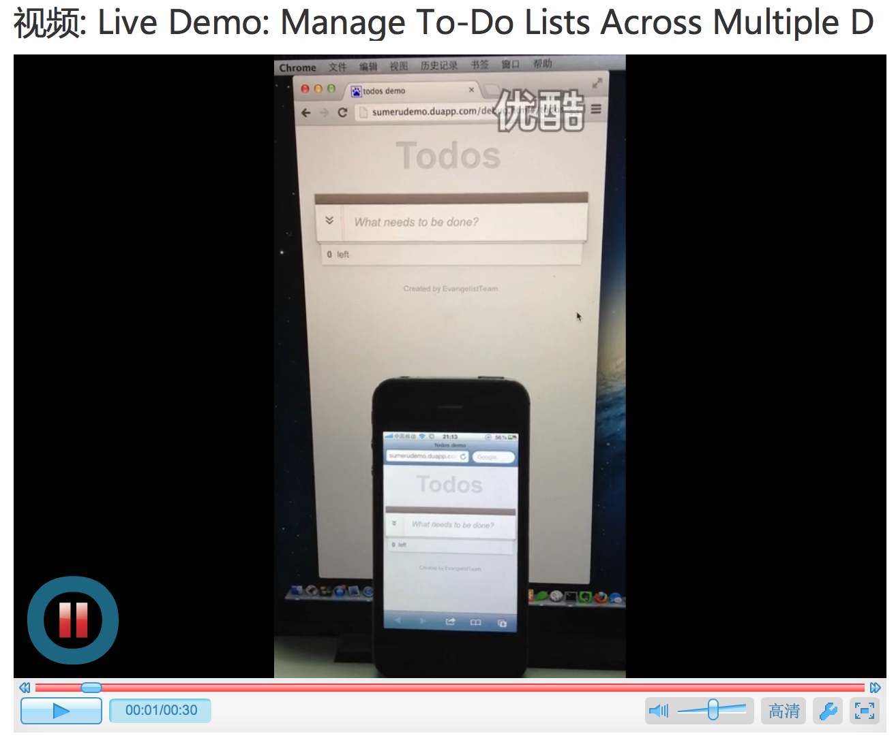

##What is Sumeru Framework?

Sumeru Framework, a simple but powerful Web App framework, provides rich functionalities for building de-facto Web Applications based on cloud technology. Sumeru framework offers awesome features such as data-unify, adaptive feedback, realtime network connection etc. Developers benefits from Sumeru Framework in terms of coding efforts, performance and application distribution.

## Live Demo: Manage To-Do Lists Across Multiple Devices

[Click and use multiple devices/browsers simultaneously to tryout the live demo with realtime sync of To-Do Lists](http://sumerutodolist.duapp.com)

[Click to see a live video ====>](http://v.youku.com/v_show/id_XNTI5NzcxNTcy.html) 

##How to install and run sumeru

### Install

	npm install -g sumeru
	
### Init a sumeru project

	sumeru init ./myproject
	
### Run sumeru

	cd myproject
	
	sumeru start

##How to update existing installation to the lastest version

### Check current installed version

	npm ls -g sumeru

or

	grep '"version"' /usr/local/lib/node_modules/sumeru/package.json

### Check the up-to-date version number

	npm view sumeru version

### Update sumeru 

	npm update -g sumeru
	
### Update existing project to use the lastest version (with auto backup, of course)

	sumeru update ./myproject
	
	or
	
	sudo sumeru update ./myproject

## Documents

Step1: [Getting Started](https://github.com/brandnewera/sumeru/blob/master/docs/step1_getting_started.md)

Step2: [Your First App](https://github.com/brandnewera/sumeru/blob/master/docs/step2_your_first_app.md)

Step3: [Overview](https://github.com/brandnewera/sumeru/blob/master/docs/step3_overview.md)
	
Step4: [API Documentation](https://github.com/brandnewera/sumeru/blob/master/docs/step4_API_Documentation.md)
