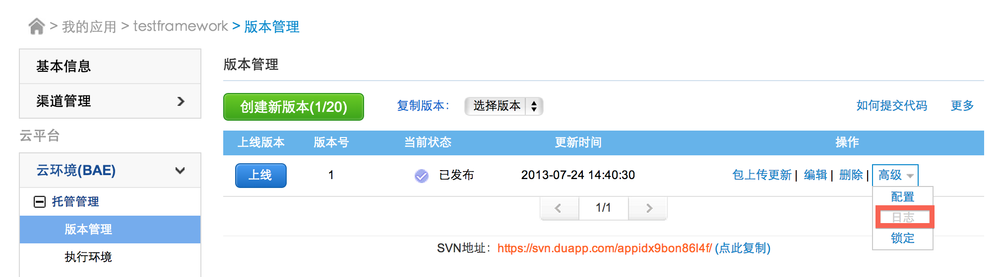
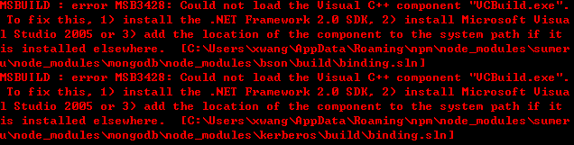

1. 如何查看Clouda在BAE上的log？

    答： “云环境（BAE）” -> “版本管理” -> “高级” -> “日志”

    

2. “XMLHttpRequest cannot load http://sfenglish.sx.duapp.com/socket/info. Origin http://sfenglish.duapp.com is not allowed by Access-Control-Allow-Origin.”错误解决。

    答：该错误说明Clouda服务器代码出险错误，可查看Clouda在BAE上的log定位问题。

3. 在Controller中使用env.redirect()跳转后出险页面覆盖和重叠的问题？

	答：在Controller中使用onrender()渲染页面时需要使用转场效果，例如使用doRender("view", ['push','left']);这样就不会出险view覆盖和重叠的问题。具体转场效果请参考Controller。

	如果问题没有解决可在CSS中加入下面的样式

	    .wrap{
            overflow-x: hidden;
        }

4. 数据库连接数超限，{ [MongoError: Connect Number Excceed] name: 'MongoError', errmsg: 'Connect Number Excceed', ok: 0 }

	答：在BAE目录中删除node_modules/mongodb目录并进行svn提交，本地目录不变。

5. 出现“Failed to load resource: the server responded with a status of 404 (Not Found) http://sfenglish.duapp.com/bin/sumeru.css”问题？

    答：该问题是没有生成bin文件，可是用 “你的域名/debung.html”先访问生成bin下的文件，然后再正常访问。

6. 为什么我的app在IE上不能加载？

	答：Clouda仅支持webkit浏览器

7. 出现“MSBUILD : error MSB3428: Could not load the Visual C++ component ‘VCBuild.exe’.”

    答：按照出错之后的提示安装 .NET Framework 2.0 SDK以及安装Microsoft Visual Studio 2005。