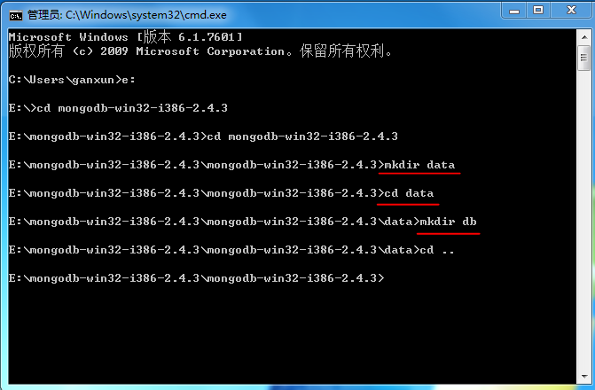
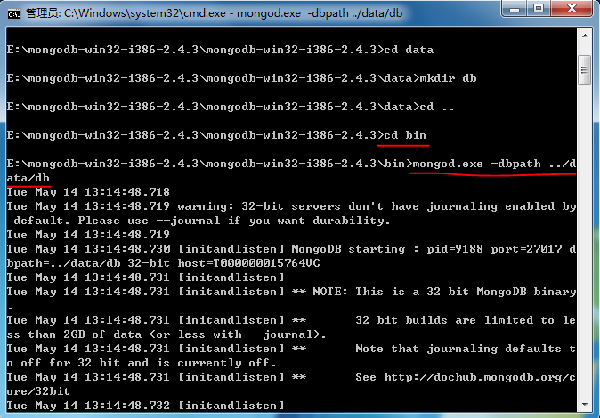

# sumeru环境搭建

sumeru是以JavaScript为唯一开发语言并专注于开发移动App的云端统一开发框架，使用sumeru开发的App，既可以作为Web App运行，也可以打包作为Native App安装，其以打造全新App架构为使命，提供使用Javascript抹平云和端的新世界，你将不再需要切换语言分别编写服务器和客户端逻辑；你将不再需要花费原来50%以上的精力遍历、操作DOM和管理链接，只需专心编写最核心的业务逻辑。

这篇文档主要介绍如何在本地搭建sumeru的运行环境。（本文档以Window系统为测试环境）

## 1. 安装node.js

sumeru是基于node.js的开发框架，所以我们首先需要安装node.js

* 下载node.js，地址：<http://nodejs.org/download/>

* 安装node.js

* 启动cmd.exe，并在命令行中输入

		node --help
		
	
	
	出现上图所示，表明node.js已经安装成功。

## 2. 安装mongoDB

在本地sumeru已mongoDB作为数据库，按照下面的步骤安装并启动mongDB

* 下载mongoDB，地址：<http://www.mongodb.org/downloads>

* 解压下载的文件夹

* 启动cmd.exe，进入解压后的目录，在根目录下创建"data"目录，并在创建的"data"目录下创建"db"文件夹

* 进入根目录下的bin/，启动mongodb

		mongod.exe -dbpath ../data/db	
		

** 注意： 在运行sumeru应用前必须启动mongoDB并运行在后台 **

环境搭建到此已经结束，如何使用sumeru开发请参照[《step1_getting_started.md》](https://github.com/brandnewera/sumeru/blob/master/docs/step1_getting_started.md)

   
