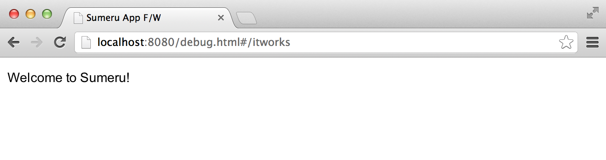
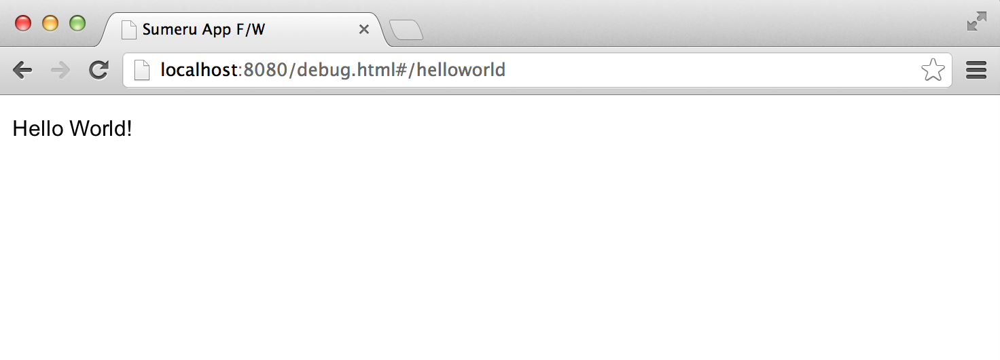

## 安装和使用Clouda

### 安装Clouda

Clouda是基于node.js的Webapp开发框架，在使用Clouda时需要安装**node.js**和**MongoDB**，如果您没有安装请参考本文档**环境搭建**部分。

使用下面命令安装Clouda

	npm install -g sumeru

### 使用Clouda创建工程

	sumeru init ./myproject

### 运行Clouda

**在运行Clouda前需要启动MongoDB**

	cd myproject
	sumeru start

### 如何访问应用

在Clouda框架中有一个itworks的实例，可以在浏览器中输入 localhost:8080/debug.html/itworks 来运行。

## Hello World

上面我们已经成功安装并启动了Clouda，下面我们使用Clouda开发一个“Hello World”应用。

### （1）在"app/controller/"下创建helloworld.js文件，输入以下代码：

* helloworld.js

		sumeru.router.add(
			{
			    pattern: '/helloworld',
				action: 'App.helloworld'
			}
		);

	通过router添加一个URL与Controller的映射关系，关于router我们会在后续文档中做专门的说明，保持helloworld.js文件打开，并输入以下代码。

		App.helloworld = sumeru.controller.create(function(env,session){
			env.onrender = function(doRender){
				doRender("helloworld",["push", "left"]);
			};
		});

	**env.onrender()**方法是完成对view(界面)的渲染，关于该方法在后续会做专门说明。

### （2）打开“app/controller/package.js”

* package.js:

		sumeru.packages(
			'helloworld.js'
		);

	package.js用于将文件之间的依赖关系添加到sumeru中，关于package.js在后续会做专门的说明。

### （3）在"app/view/"下创建helloworld.html，并输入已下代码

* helloworld.html

		
Hello World!

**至此**，"Hello World"应用代码已经完成。

在浏览器中输入"localhost:8080/debug.html/helloworld"运行该应用。

## 环境搭建

### 安装node.js

Clouda是基于node.js的开发框架，所以我们首先需要安装node.js

* 下载node.js，地址：<http://nodejs.org/download/>

* 安装node.js

### 安装MongoDB

在本地sumeru已mongoDB作为数据库，按照下面的步骤安装并启动MongoDB

* 下载mongoDB，地址：<http://www.mongodb.org/downloads>

* 解压下载的文件夹，进入解压后的目录，在根目录下创建"data"目录，并在创建的"data"目录下创建"db"文件夹

* 进入根目录下的bin/，启动MongoDB

		sudo ./mongodb -dbpath ../data/db

**注意：在运行Clouda应用前必须启动MongoDB**
	
