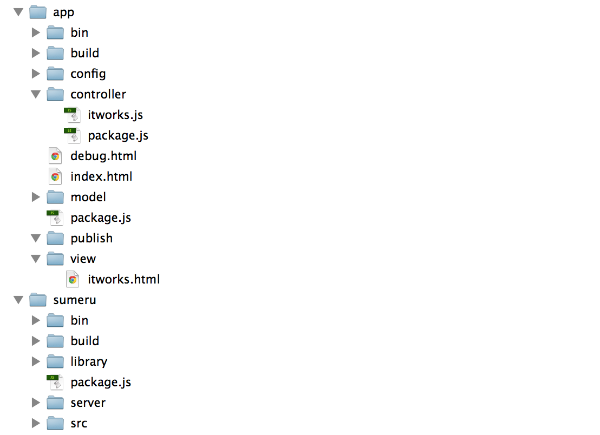

从这里开始
====================

欢迎来到sumeru的世界，在这里，您将获得超乎想象、无比便捷的开发体验。

sumeru是以JavaScript为唯一开发语言并专注于开发移动App的云端统一开发框架，使用sumeru开发的App，既可以作为Web App运行，也可以打包作为Native App安装，其以打造全新App架构为使命，提供使用Javascript抹平云和端的新世界，你将不再需要切换语言分别编写服务器和客户端逻辑；你将不再需要花费原来50%以上的精力遍历、操作DOM和管理链接，只需专心编写最核心的业务逻辑。

Sumeru, a simple but powerful Web App framework, provides rich functionalities for building de-facto Web Applications based on Baidu Cloud technology. Sumeru offers awesome features such as data-unify，adaptive feedback，realtime network connection etc. Developers benefits from Sumeru in terms of coding efforts, performance and application distribution.

## 一. 获取sumeru

sumeru基于node.js开发，可使用npm获取。

	npm install -g sumeru
	
现在，我们创建一个sumeru项目。

	sumeru init ./myproject
	
myproject是项目所在目录，你可提前创建，也可由sumeru自动创建。
	
在每一个生成项目中，都会有一个可运行的应用,首先使用下面的命令启动sumeru。

	cd myproject
	
	sumeru start
	
在运行应用之前，请确保已经安装并启动mongoDB，保持mongoDB在后台运行，然后在浏览器中输入 localhost:8080/debug.html#/itworks 第一次运行sumeru。

同时我们也提供手动下载方式，[点击这里下载](https://github.com/brandnewera/sumeru/archive/master.zip)

## 二. “Hello World”

上面我们已经成功安装并启动了sumeru，下面我们真正使用sumeru开发一个“Hello World”应用。

### 第一步：在"app/controller/"下创建helloworld.js文件，输入以下代码：

* helloworld.js

		sumeru.router.add(

			{
				pattern: '/helloworld',
				action: 'App.helloworld'
			}

		);

	通过router添加一个URl与Controller的映射关系，关于router我们会在后续文档中做专门的说明，保持helloworld.js文件打开，并输入以下代码。
	
		App.helloworld = sumeru.controller.create(function(env,session){

			env.onrender = function(doRender){
				doRender("helloworld",["push", "left"]);
			};

		});	

	**env.onrender()**方法是完成对view(界面)的渲染，关于该方法在后续会做专门说明。
	
### 第二步：打开“app/controller/package.js”

* package.js:

		sumeru.packages(

			'helloworld.js'

		);

	package.js用于将文件之间的依赖关系添加到sumeru中，关于package.js在后续会做专门的说明。

	

### 第三步：在"app/view/"下创建helloworld.html，并输入已下代码

* helloworld.html

	
		
Hello World!

		
** 至此 **，"hello world"应用代码已经完成。

在浏览器中输入"localhost:8080/debug.html#/helloworld"运行该应用。

你可能已经发现，一个sumeru的项目有以下目录组成

对于sumeru目录在后续会做专门的介绍。
	
