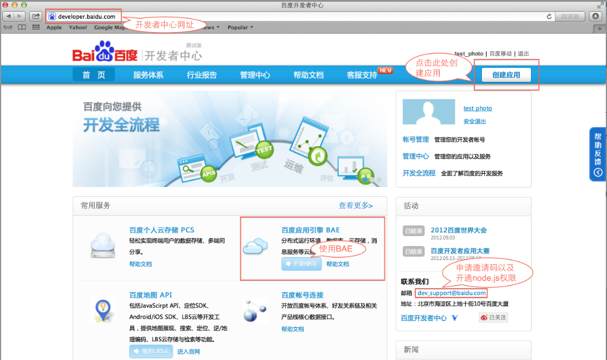
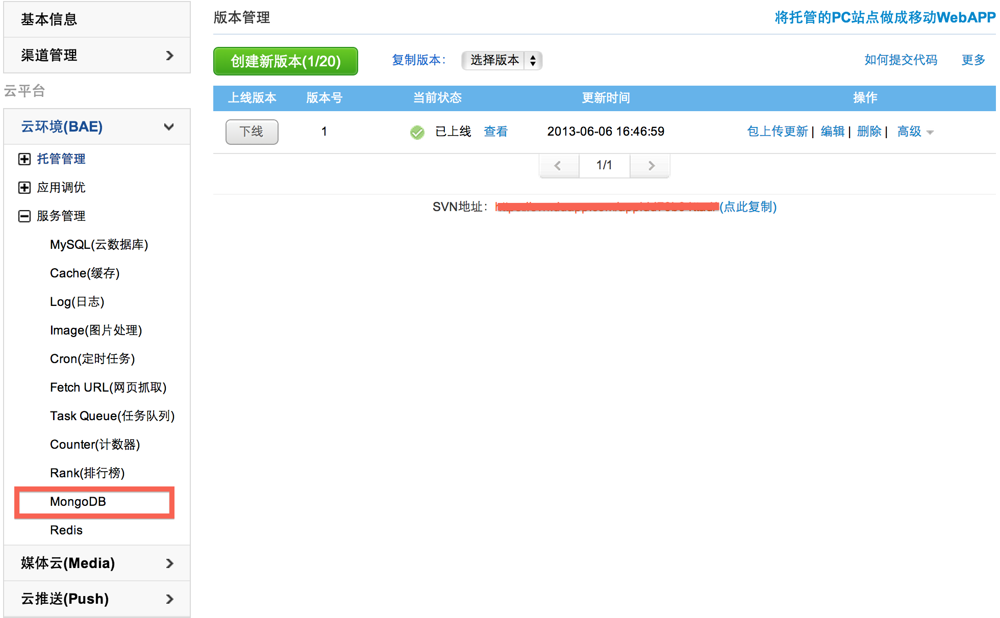
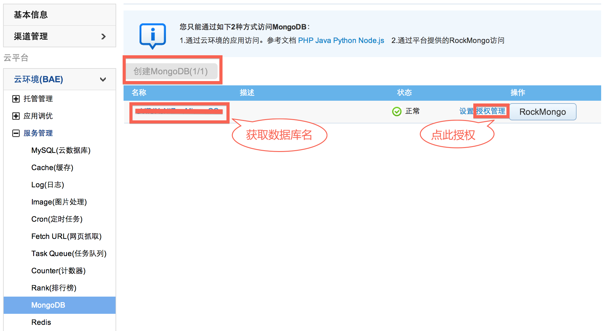

# Clouda托管到BAE

Clouda是基于node.js开发的，所以需要node.js环境以及需要数据库的支持，百度开发者中心上BAE提供整套的环境的支持，只需简单的配置就可以快速运行基于Clouda开发的应用，具体方法如下：

（1）登陆[百度开发者中心](http://developer.baidu.com)，如果没有百度帐号请先注册百度帐号，并注册成为开发者；

（2）使用BAE，如果是第一次使用，需要先发送邮件到dev_support@baidu.com申请开通node.js权限。

（3）node.js权限开通后，点击 “创建应用” ，如图：

（4）点击 “确定”后在页面点击“云环境(BAE)”

（5）完成“应用域名”申请，以及选择使用“node.js”环境

（6）“创建新版本”，并使用SVN下载版本代码

（7）将本地sumeru工程文件拷贝到SVN下载版本代码目录下
	
（8）如果需要在BAE上使用MongoDB数据库，请按照下面方法创建MongoDB和获取数据库名

* 在“版本管理”页面，点击“服务管理”并选择 “MongoDB”

* 在“MongoDB”页面点击“创建MongoDB”，创建一个新的MongoDB数据库并**获取数据名**

	 
（9）修改app/server_config/bae.js

    将第8步获取的dbname填入 dbname:

    将第5步申请的域名填入 site_url:

（10）进入node_modules/，删除mongodb

（11）使用SVN或者GIT上传代码，并在BAE上线该应用，访问您自己的应用地址，如果您是使用示例程序，可以访问 域名+index.html/itworks

